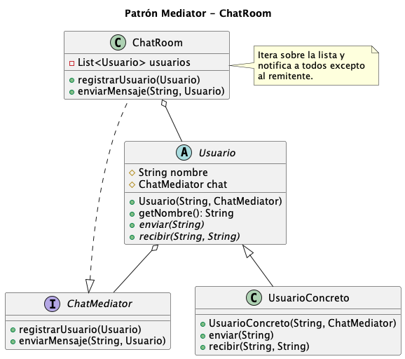

***

# Chat Mediator (Patrón Mediator en Java)

Proyecto de ejemplo en Java que implementa el **patrón de diseño Mediator** para gestionar la comunicación entre usuarios dentro de una sala de chat grupal.

## Descripción del problema

En una sala de chat grupal, varios usuarios se envían mensajes entre sí.  
Si cada usuario tuviera que conocer y enviar mensajes directamente a todos los demás:

- Cada usuario mantendría referencias a muchos otros usuarios.  
- Al agregar o eliminar usuarios habría que modificar varias clases.  
- El sistema se volvería difícil de escalar y mantener.

## ¿Por qué uso el patrón Mediator?

El patrón **Mediator** centraliza la comunicación en un objeto mediador, reduciendo las dependencias directas entre los objetos que colaboran. [refactoring](https://refactoring.guru/es/design-patterns/mediator)

En este ejercicio:

- El mediador es `ChatRoom`, que conoce a todos los usuarios registrados.  
- Los usuarios (`UsuarioConcreto`) solo conocen al mediador, no a los demás usuarios.  

Gracias a esto:

- Para enviar un mensaje, un usuario solo llama a `chat.enviarMensaje(...)`.  
- El mediador decide a quién reenviar el mensaje.  
- Agregar un nuevo usuario solo implica registrarlo en el mediador, sin tocar el código de los otros usuarios.

## Estructura de clases

- `ChatMediator` (interface)  
  - Define las operaciones del mediador:  
    - `registrarUsuario(Usuario usuario)`  
    - `enviarMensaje(String mensaje, Usuario remitente)`

- `ChatRoom` (implementa `ChatMediator`)  
  - Mantiene una lista de usuarios registrados.  
  - Cuando recibe un mensaje, lo reenvía al resto de usuarios.

- `Usuario` (clase abstracta)  
  - Atributos: `nombre`, referencia a `ChatMediator`.  
  - Métodos abstractos: `enviar(String mensaje)` y `recibir(String mensaje, String remitente)`.

- `UsuarioConcreto` (extiende `Usuario`)  
  - Implementa la lógica para enviar y recibir mensajes a través del mediador.

- `Main`  
  - Crea la sala de chat (`ChatRoom`).  
  - Crea varios usuarios, los registra en el mediador y simula el envío de mensajes.

## Diagrama UML

El siguiente diagrama ilustra cómo el mediador centraliza la lógica de comunicación, permitiendo que los objetos "Colega" (Usuarios) permanezcan desacoplados entre sí.




## Justificación técnica del Patrón
Se seleccionó el patrón **Mediator** para este escenario por las siguientes razones:

* **Reducción del acoplamiento (Many-to-Many a Many-to-One):** En lugar de que cada objeto `Usuario` mantenga referencias de todos los demás participantes (lo que crearía una red de dependencias compleja), los usuarios solo conocen la interfaz `ChatMediator`.
* **Centralización de la lógica de difusión:** El `ChatRoom` es el único lugar donde reside la lógica de envío (Broadcasting). Si en el futuro se desea implementar un filtro de palabras, registro de logs o mensajes privados, solo se debe modificar el mediador sin alterar a los usuarios.
* **Principio de Responsabilidad Única:** Los usuarios solo se preocupan por su contenido (enviar y recibir), delegando la responsabilidad de la logística de entrega al mediador.
* **Escalabilidad:** Facilita la adición de nuevos tipos de participantes (como bots o administradores) simplemente extendiendo la clase abstracta `Usuario`, cumpliendo así con el principio Open/Closed.

## Requisitos

- Java 21 (o compatible).  
- Maven.

## Cómo ejecutar

1. Abrir el proyecto en tu IDE.  
2. Ejecutar la clase `Main` (por ejemplo, `com.chat_mediator.Main`).  

Ejemplo de salida en consola:

```text
Andrés envía: Hola a todos!
María recibe de Andrés: Hola a todos!
Juan recibe de Andrés: Hola a todos!
María envía: Hola Andrés, ¿cómo estás?
Andrés recibe de María: Hola Andrés, ¿cómo estás?
Juan recibe de María: Hola Andrés, ¿cómo estás?
```

## Aprendizajes y objetivos

Este proyecto muestra:

- Aplicación del patrón de comportamiento **Mediator** en un escenario de chat grupal.  
- Reducción del acoplamiento entre objetos (usuarios) al centralizar la comunicación en un mediador.  
- Facilidad para agregar o eliminar usuarios sin modificar la lógica de los demás.

***

